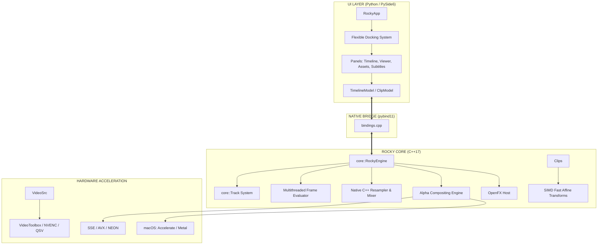

# Rocky Video Editor: The Hybrid NLE Powerhouse 🚀

**Rocky Video Editor** is a next-generation non-linear video editing (NLE) system. It combines the extreme performance of a native C++ engine with the modular flexibility of a Python-based interface (PySide6). Designed for high-end production, professional transcription, and real-time 4K playback.

---

## 🇪🇸 Castellano: El Motor de Vídeo Híbrido Definitivo

Rocky Video Editor no es solo una aplicación; es una pieza de ingeniería diseñada para ser el editor más rápido y flexible del mercado open source.

### ✨ Características Destacadas
*   **🚀 Núcleo C++17 Nativo**: Motor de composición multihilo que gestiona miles de clips con latencia cero usando estructuras de datos avanzadas (`Interval Trees`).
*   **🎨 Interfaz Modular (Estilo Blender)**: Sistema de paneles dinámicos dividibles con soporte para iconografía profesional de 64x64 y estética Matte moderna.
*   **🧠 IA Integrada (OpenAI Whisper)**: Generación automática de subtítulos con precisión quirúrgica y posicionamiento WYSIWYG en el visor.
*   **🔈 Audio Pro Nativo**: Mezclador de audio de 64 bits con remuestreo lineal en C++ para transiciones y shuttling sin cortes.
*   **🔌 Ecosistema OpenFX**: Soporte completo para plugins de efectos profesionales estándar de la industria.
*   **🍏 Optimización Apple Silicon**: Aceleración por hardware dedicada para chips M1/M2/M3 mediante el framework Accelerate y Metal.

---

## 🏗 System Architecture & Engineering

Rocky's unique strength lies in its **"Engine-Frontend separation"** philosophy, bridging high-level GUI flexibility with low-level hardware performance.

### 🗺 Full System Schema

### 🎞 High-Performance Rendering Pipeline
Every frame you see is processed through a zero-copy pipeline between C++ and Python:
1.  **Interval Tree Query**: Rocky identifies active clips in $O(\log n)$ time.
2.  **Multithreaded Decoding**: FFmpeg decodes frames in parallel using hardware acceleration.
3.  **Affine Transformation Engine**: Rotation, scaling, and positioning are calculated at the pixel level in C++.
4.  **Audio Sync**: Native C++ resampler ensures audio stays locked to the video clock even during speed changes (Shuttle).
5.  **Zero-Copy Handover**: Frames are passed to the PySide6 UI without costly memory copies, maintaining a steady 60 FPS.

---

## 🛠 Advanced Features

### 🔌 OpenFX Plugin Ecosystem
Rocky implements the **OpenFX (OFX)** standard, allowing third-party integration of high-performance effects.
- Direct host implementation in `src/core/ofx/`.
- Dynamic loading of `.ofx` or `.so` plugin files.

### 🔤 Professional Subtitle Engine
- **Direct Transcription**: Integrated with OpenAI's **Whisper** for automatic subtitle generation.
- **Precision Positioning**: Position is calculated in project-relative pixels for consistent export regardless of resolution.
- **Anti-Distortion Tech**: Smart scaling logic ensures fonts maintain their native aspect ratio.

### 🔃 Smart Proxy & Hybrid Infrastructure
- **Background Workers**: Proxy generation and waveform analysis happen in separate threads (QThread).
- **Metadata Cache**: Immediate UI response by caching FFmpeg probe results.

---

## 🚀 Build & Deployment

Rocky is a cross-platform tool with robust automation scripts.

### 💻 Local Compilation

| OS | Build Command | Run Command |
| :--- | :--- | :--- |
| **macOS** | `./compile.sh` (Homebrew auto-setup) | `./run.sh` |
| **Linux** | `./compile.sh` (Native build) | `./run.sh` |
| **Windows** | `compile.bat` (MSVC / Python auto) | `run.bat` |

---

## 🔍 Codebase Core Documentation

For developers looking to contribute, here are the critical modules:

### Core Engine (C++17)
*   [`engine.cpp`](file:///src/core/engine.cpp): The "brain" of the renderer. Manages the master clock and track composition.
*   [`clip.cpp`](file:///src/core/clip.cpp): Handles individual clip logic and **Transform Matrices**.
*   [`media_source.cpp`](file:///src/core/media_source.cpp): The FFmpeg integration layer. Responsible for frame decoding and HW detection.
*   [`interval_tree.h`](file:///src/core/interval_tree.h): High-performance data structure for real-time clip querying.

### Logic & UI (Python)
*   [`rocky_ui.py`](file:///src/ui/rocky_ui.py): Main application entry point and orchestrator.
*   [`panels.py`](file:///src/ui/panels.py): Modular panel system (Blender-Inspired).
*   [`models.py`](file:///src/ui/models.py): Data models and native-delegated timecode formatting.

---
*Engineered with precision. Rendered with excellence.*
**Cory Rocky.**
